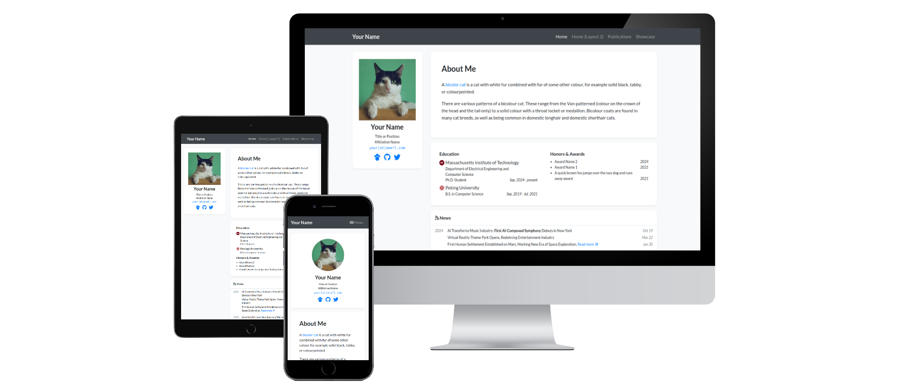

# academic-homepage



[](https://github.com/luost26/academic-homepage/actions/workflows/pages/pages-build-deployment)
[](https://validator.nu/?doc=https%3A%2F%2Fluost26.github.io%2Facademic-homepage)
[](https://hits.seeyoufarm.com)
[](https://github.com/luost26/academic-homepage)
[](https://github.com/luost26/academic-homepage/forks)

A GitHub Pages (Jekyll) template for personal academic website. Click [here](https://luost.me/academic-homepage/) to see the demo.

## User Community

[:star:](https://luost.me/)
[:star:](https://cch1999.github.io/)
[:star:](https://kyrrego.github.io/)
[:star:](https://ced3-han.github.io/)
[:star:](https://lihengchen.com/)
[:star:](https://hpwang-whu.github.io/)
[:star:](https://zhang-yingyi.github.io/)
[:star:](https://wby24.github.io/)
[:star:](https://pengfeixu.com/)
[:star:](https://boqiuphd.github.io/)
[:star:](https://www.huabing.li/)
[:star:](https://xiecuiying.github.io/)
[:star:](https://hannyang.github.io/)
[:star:](https://king-play.github.io/)

:hugs: Feel free to tell us if you are using this template for your website by creating an issue [here](https://github.com/luost26/academic-homepage/issues/new?assignees=&labels=&projects=&template=user-report.md&title=I+am+using+this+template%21).


## Need Help?

If you run into **any** issues while using this template, or have suggestions for improvements, please don't hesitate to create an issue [here](https://github.com/luost26/academic-homepage/issues/new).


## Getting Started

1. First, fork this repository or click the "Use this template" button to create a new repository. The name of the repository should be `<your-github-username>.github.io` (click [here](https://docs.github.com/en/pages/getting-started-with-github-pages/about-github-pages#types-of-github-pages-sites) to learn more about naming a GitHub Pages repository).
   - If you plan to customize the functionality or style of the template, and do not want to get updates from this repository, choose "Use this template".
   - If you plan to only edit the content (biography, publications, news, etc.), and would like to get updates from this repository, choose "Fork".
   - If you want to contribute to this project, fork the repository and submit a pull request.

### Running Locally (Debug & Preview)

2. Follow the **step 1** and **step 2** of the instruction [here](https://jekyllrb.com/docs/) to install prerequisites and jekyll.

3. Clone your forked repository to your local machine.

4. Run the following command in the root directory of the repository:

   ```bash
   bundle exec jekyll serve
   ```

5. Browse to the displayed URL to see the website.

### Deploying to GitHub Pages

2. Go to the repository settings and enable GitHub Pages. Detailed instructions can be found [here](https://docs.github.com/en/pages/getting-started-with-github-pages/creating-a-github-pages-site#creating-your-site).

3. Navigate to your created website, and follow the instructions displayed on the homepage (if any) to finalize the setup.

